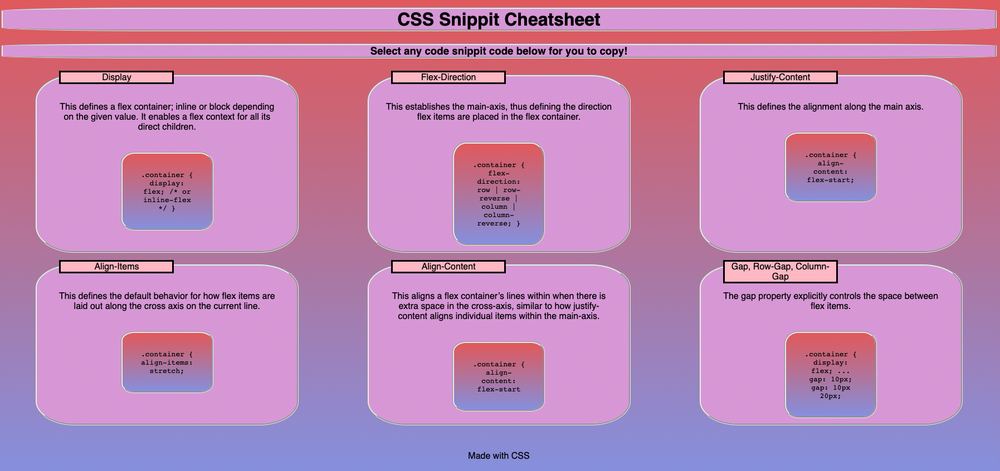

# Css-Cheat-Sheet
# <Your-Project-Title>

## Description

This is a css cheat sheet made to practice css and html skills like:

- Flexboxes
- Linnear-gradients
- @media queries
- Pseudo-classes

    

## Credits

https://github.com/MiltonTal

